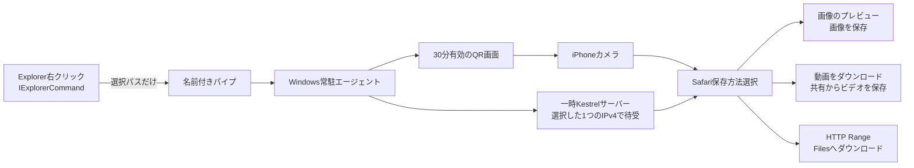

# アーキテクチャ

## コンポーネント境界

- `windows/ShellExtension`: Explorer内でネットワーク通信をせず、選択パスだけを常駐処理へ渡す。
- `windows/BackgroundAgent`: ファイル準備、QR生成、一時Webサーバー、Range送信、通知を担当。
- `windows/SettingsApp`: 右クリック名、自動起動、通知、テスト送信を設定。
- `windows/Installer`: MSIX、右クリック拡張、プライベートネットワーク機能を登録。
- `windows/Protocol`と`ios/LocalBridge`: 実験用のネイティブ暗号化受信モード。標準Web方式の受信にはiPhoneアプリを使わない。Windows側には共通コードの参照があるため、公開版でもProtocolを保持する。

## 採用しないもの

- クラウドへのファイル保存
- 外部アカウント、外部テレメトリー
- Explorerプロセス内のWebサーバーやファイル転送
- Safariを閉じた状態から起動させる非標準処理
